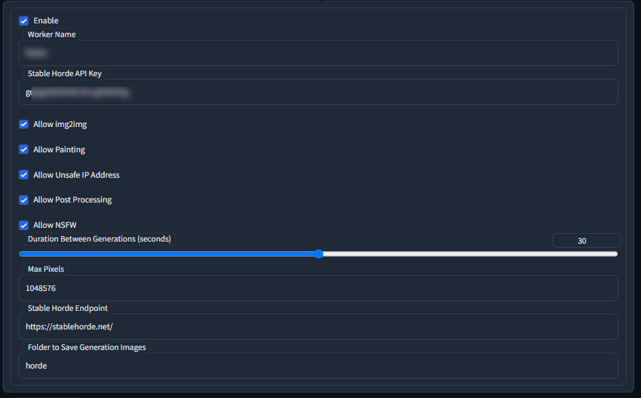

<p align="center">
  </img>
</p>

<div align="center">

# SD WebUI ❤️ Stable Horde


[](https://github.com/sdwebui-w-horde/sd-webui-stable-horde-worker/issues)
[](https://github.com/sdwebui-w-horde/sd-webui-stable-horde-worker/pulls)
[](LICENSE)
[](https://github.com/sdwebui-w-horde/sd-webui-stable-horde-worker/actions/workflows/lint.yml)

✨ *Stable Horde Worker Bridge for Stable Diffusion WebUI* ✨

</div>

An unofficial [Stable Horde](https://stablehorde.net/) worker bridge as a [Stable Diffusion WebUI](https://github.com/AUTOMATIC1111/stable-diffusion-webui) extension.

## Features

**This extension is still WORKING IN PROGRESS**, and is not ready for production use.

- Get jobs from Stable Horde, generate images and submit generations
- Configurable interval between every jobs
- Enable and disable extension whenever
- Detect current model and fetch corresponding jobs on the fly
- Show generation images in the Stable Diffusion WebUI
- Save generation images with png info text to local

## Install

- Run the following command in the root directory of your Stable Diffusion WebUI installation:

  ```bash
  git clone https://github.com/sdwebui-w-horde/sd-webui-stable-horde-worker.git extensions/stable-horde-worker
  ```

- Launch the Stable Diffusion WebUI, You would see the `Stable Horde Worker` tab page.

  

- Register an account on [Stable Horde](https://stablehorde.net/) and get your `API key` if you don't have one.

  **Note**: the default anonymous key `00000000` is not working for a worker, you need to register an account and get your own key.

- Setup your `API key` here.
- Setup `Worker name` here with a proper name.
- Make sure `Enable` is checked.
- Click the `Apply settings` buttons.

## Compatibility

Here is the compatibilities with the [official bridge](https://github.com/db0/AI-Horde-Worker).

|Features|Supported?|
|:-:|:-:|
|img2img|✔️|
|Inpainting|✔️|
|Interrogate|❌|
|Tiling|✔️|
|Hi-res Fix|❌|
|Clip Skip|❌|
|Face Restoration (GFPGAN)|✔️|
|Upscale (ESRGAN)|✔️|
|Sample Karras Scheduler|⭕*|
|R2 upload|✔️|
|R2 source image|❌|
|Multiple Models|❌|

\* Karras scheduler is partially supported in SD-WebUI Bridge, see below.

<table>
  <thead>
    <tr>
      <th rowspan="2">Samplers</th>
      <th colspan="2">Official Bridge</th>
      <th colspan="2">SD-WebUI Bridge</th>
    </tr>
    <tr>
      <th>No Karras</th>
      <th>Karras</th>
      <th>No Karras</th>
      <th>Karras</th>
    </tr>
  </thead>
  <tbody>
    <tr>
      <td align="center">k_lms</td>
      <td align="center">✔️</td>
      <td align="center">✔️</td>
      <td align="center">✔️</td>
      <td align="center">✔️</td>
    </tr>
    <tr>
      <td align="center">k_heun</td>
      <td align="center">✔️</td>
      <td align="center">✔️</td>
      <td align="center">✔️</td>
      <td align="center">✔️</td>
    </tr>
    <tr>
      <td align="center">k_euler</td>
      <td align="center">✔️</td>
      <td align="center">✔️</td>
      <td align="center">✔️</td>
      <td align="center">✔️</td>
    </tr>
    <tr>
      <td align="center">k_euler_a</td>
      <td align="center">✔️</td>
      <td align="center">✔️</td>
      <td align="center">✔️</td>
      <td align="center">✔️</td>
    </tr>
    <tr>
      <td align="center">k_dpm_2</td>
      <td align="center">✔️</td>
      <td align="center">✔️</td>
      <td align="center">✔️</td>
      <td align="center">✔️</td>
    </tr>
    <tr>
      <td align="center">k_dpm_2_a</td>
      <td align="center">✔️</td>
      <td align="center">✔️</td>
      <td align="center">✔️</td>
      <td align="center">✔️</td>
    </tr>
    <tr>
      <td align="center">k_dpm_fast</td>
      <td align="center">✔️</td>
      <td align="center">✔️</td>
      <td align="center">✔️</td>
      <td align="center">✔️</td>
    </tr>
    <tr>
      <td align="center">k_dpm_adaptive</td>
      <td align="center">✔️</td>
      <td align="center">✔️</td>
      <td align="center">✔️</td>
      <td align="center">✔️</td>
    </tr>
    <tr>
      <td align="center">k_dpmpp_2s_a</td>
      <td align="center">✔️</td>
      <td align="center">✔️</td>
      <td align="center">✔️</td>
      <td align="center">✔️</td>
    </tr>
    <tr>
      <td align="center">k_dpmpp_2m</td>
      <td align="center">✔️</td>
      <td align="center">✔️</td>
      <td align="center">✔️</td>
      <td align="center">✔️</td>
    </tr>
    <tr>
      <td align="center">k_dpmpp_sde</td>
      <td align="center">✔️</td>
      <td align="center">✔️</td>
      <td align="center">✔️</td>
      <td align="center">✔️</td>
    </tr>
    <tr>
      <td align="center">dpmsolver</td>
      <td align="center">✔️</td>
      <td align="center">✔️</td>
      <td align="center">❌</td>
      <td align="center">❌</td>
    </tr>
    <tr>
      <td align="center">ddim</td>
      <td align="center">❌</td>
      <td align="center">❌</td>
      <td align="center">✔️</td>
      <td align="center">❌</td>
    </tr>
    <tr>
      <td align="center">plms</td>
      <td align="center">❌</td>
      <td align="center">❌</td>
      <td align="center">✔️</td>
      <td align="center">❌</td>
    </tr>
  </tbody>
</table>

## License

This project is licensed under the terms of the [AGPL-3.0 License](LICENSE).
